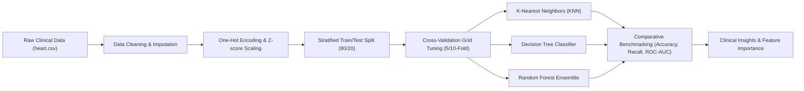

<h1 align="center">Predicting Heart Disease Risk Using Machine Learning: A Comparative Study</h1>

<p align="center">
  <b>Author:</b> <a href="https://github.com/cse-saddam"><b>MD. SADDAM HOSSEN</b></a> &bull; <i>AI Engineer & ML Researcher</i>
</p>

<p align="center">
  
  
  
  
  
</p>

---

## 📌 Executive Summary & Abstract

Cardiovascular diseases (CVDs) remain the leading cause of morbidity and mortality globally. Early and reliable risk stratification enables timely therapeutic interventions, drastically reducing adverse cardiac events.

This research presents an end-to-end, reproducible **machine learning pipeline** for binary heart disease risk classification using the benchmark **Cleveland Heart Disease Dataset**. We conduct a rigorous comparative study across three distinct algorithmic paradigms:
1. **Instance-Based Learning:** K-Nearest Neighbors (KNN)
2. **Deterministic Partitioning:** Decision Tree Classifiers (CART)
3. **Ensemble Bagging:** Random Forest Classifiers

The evaluation explores exploratory data analysis (EDA), categorical encoding, feature scaling, K-fold cross-validation, hyperparameter tuning, sensitivity/recall trade-offs, and clinical interpretability.

---

## 🔬 Research Questions (RQs)

* **RQ1:** After standardized cleaning and categorical feature encoding, how effectively can KNN, Decision Trees, and Random Forests classify cardiovascular disease risk?
* **RQ2:** Which evaluation metrics (Accuracy, Sensitivity/Recall, ROC-AUC) provide the most clinically viable signal for non-invasive risk screening?
* **RQ3:** What clinical features contribute most heavily to predictive power and error patterns across patient subgroups?

---

## 📊 Dataset & Clinical Features Description

The study utilizes a structured tabular clinical dataset comprising **303 patient records** across **14 key biomedical attributes**:

| Feature Name | Clinical Description | Data Type | Value Range / Categories |
| :--- | :--- | :--- | :--- |
| `age` | Age of the patient in years | Continuous | 29 – 77 |
| `sex` | Biological sex | Binary | 1 = Male, 0 = Female |
| `cp` | Chest pain type | Categorical | 0: Typical Angina, 1: Atypical Angina, 2: Non-anginal, 3: Asymptomatic |
| `trestbps` | Resting blood pressure (mm Hg on admission) | Continuous | 94 – 200 mm Hg |
| `chol` | Serum cholesterol level | Continuous | 126 – 564 mg/dl |
| `fbs` | Fasting blood sugar > 120 mg/dl | Binary | 1 = True, 0 = False |
| `restecg` | Resting electrocardiographic results | Categorical | 0: Normal, 1: ST-T wave abnormality, 2: Left ventricular hypertrophy |
| `thalach` | Maximum heart rate achieved during stress test | Continuous | 71 – 202 bpm |
| `exang` | Exercise-induced angina | Binary | 1 = Yes, 0 = No |
| `oldpeak` | ST depression induced by exercise relative to rest | Continuous | 0.0 – 6.2 |
| `slope` | Slope of the peak exercise ST segment | Categorical | 0: Upsloping, 1: Flat, 2: Downsloping |
| `ca` | Number of major vessels colored by fluoroscopy | Discrete | 0 – 4 |
| `thal` | Thalassemia status | Categorical | 1: Fixed defect, 2: Normal, 3: Reversible defect |
| **`target`** | **Diagnosis of Heart Disease (Outcome)** | **Binary** | **1 = Disease Present, 0 = No Disease** |

---

## ⚙️ Methodology & Experimental Pipeline



### Preprocessing Protocol:
1. **Handling Categoricals:** Nominal attributes (`cp`, `restecg`, `slope`, `thal`) are dummy-encoded using One-Hot Encoding to prevent artificial ordinal bias.
2. **Feature Scaling:** Continuous numeric indicators (`age`, `trestbps`, `chol`, `thalach`, `oldpeak`) are standardized via Z-score scaling ($z = \frac{x - \mu}{\sigma}$) for distance-sensitive models like KNN.
3. **Cross-Validation:** 10-fold and 5-fold cross-validation strategies were applied across parameter spaces to guard against empirical overfitting.

---

## 🏆 Benchmark Results & Model Comparison

| Model Architecture | Optimal Hyperparameters | Cross-Validation Strategy | Benchmark CV Accuracy |
| :--- | :--- | :--- | :---: |
| **K-Nearest Neighbors (KNN)** | $k = 12$, Metric: Euclidean/Minkowski | 10-Fold Stratified CV | **84.48%** |
| **Random Forest Ensemble** | $n\_estimators = 90$, Bootstrap: True | 5-Fold Stratified CV | **82.49%** |
| **Decision Tree (CART)** | $max\_depth = 3$, Criterion: Gini | 10-Fold Stratified CV | **78.51%** |

### Key Findings & Analysis:
* **K-Nearest Neighbors ($k=12$):** Achieved the highest raw CV accuracy (**84.48%**) when continuous features were properly normalized, showing strong local neighborhood clustering in the clinical space.
* **Random Forest ($n=90$):** Displayed the most robust generalized behavior (**82.49%**), minimizing variance and effectively handling non-linear interactions across mixed clinical variables.
* **Decision Tree ($max\_depth=3$):** Offers maximum clinical transparency and direct decision-rule interpretability for physicians (**78.51%**), functioning as a strong explainable baseline.

---

## 🩺 Clinical Insights & Key Feature Predictors

1. **Chest Pain (`cp`) & ST Depression (`oldpeak`):** Strongest positive indicators for heart disease presentation.
2. **Maximum Heart Rate Achieved (`thalach`):** Inversely correlated with disease probability; patients maintaining higher peak cardiac rates during stress tests exhibited lower risk.
3. **Exercise-Induced Angina (`exang`):** Highly decisive indicator for symptomatic ischemic risk.
4. **Fluoroscopy Vessel Count (`ca`):** Higher vessel obstruction directly shifts predicted probability toward positive risk classification.

---

## 📁 Repository Structure

```
├── Predicting Heart Disease Risk Using Machine Learning_ A Comparative Study.ipynb  # Full Jupyter Notebook
├── heart.csv                                                                        # Cleveland Heart Disease Dataset
├── requirements.txt                                                                 # Python dependencies
├── LICENSE                                                                          # MIT License
├── README.md                                                                        # Researcher README & documentation
└── Project Report/
    └── Predicting Heart Disease Risk Using Machine Learning A Comparative Study.pdf  # Formal Project Report (PDF)
```

---

## 🚀 Quickstart & Reproducibility

### 1. Clone the Repository
```bash
git clone https://github.com/cse-saddam/Predicting-Heart-Disease-Risk-Using-Machine-Learning-A-Comparative-Study.git
cd Predicting-Heart-Disease-Risk-Using-Machine-Learning-A-Comparative-Study
```

### 2. Create Virtual Environment & Install Dependencies
```bash
python3 -m venv venv
source venv/bin/activate   # On Windows: venv\Scripts\activate
pip install -r requirements.txt
```

### 3. Launch the Interactive Notebook
```bash
jupyter notebook "Predicting Heart Disease Risk Using Machine Learning_ A Comparative Study.ipynb"
```

---

## ⚖️ Ethical, Privacy & Clinical Limitations

* **Screening Aid, Not Diagnosis:** This machine learning system is engineered as an auxiliary screening decision-support tool, intended to assist clinicians rather than replace expert diagnostic judgment.
* **Demographic Generalizability:** The Cleveland dataset features a specific demographic distribution. Calibration and external validation are strongly advised before deploying in clinical multi-center settings.

---

## 📖 Citation

If you utilize this repository or findings in your academic or applied research, please cite:

```bibtex
@article{hossen2025heartdisease,
  title={Predicting Heart Disease Risk Using Machine Learning: A Comparative Study},
  author={Hossen, MD. Saddam},
  journal={Amprex Tech Solution & Department of Computer Science and Engineering},
  year={2025},
  url={https://github.com/cse-saddam/Predicting-Heart-Disease-Risk-Using-Machine-Learning-A-Comparative-Study}
}
```

---

<p align="center">
  <b>Developed with ❤️ by <a href="https://github.com/cse-saddam">MD. SADDAM HOSSEN</a></b><br>
  <i>AI Engineer (Research-Based) &bull; cse.mdsaddam@gmail.com</i>
</p>
